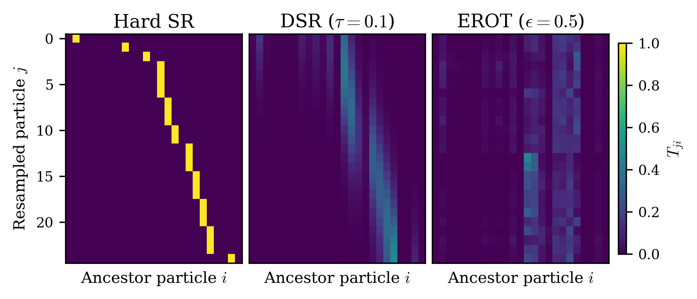

<div align="center">

# Differentiable Systematic Resampling for Variational Sequential Monte Carlo

Fredrik Cumlin · Saikat Chatterjee

[](#citation)
[](requirements.txt)
[](requirements.txt)
[](LICENSE)



*Transport plans of hard systematic resampling (left), DSR with $\tau = 0.1$
(middle) and EROT (right) for a particle filter of Lorenz-63 with $N = 25$
particles. DSR preserves the banded, CDF-ordered structure of systematic
resampling.*

</div>

## DSR

Systematic resampling draws a single offset $u_0 \sim \mathcal{U}(0, 1/N)$,
places the comb $u_j = u_0 + (j-1)/N$, and assigns particle $j$ the ancestor
$a_j$ for which $F_{a_j-1} < u_j \leq F_{a_j}$, where $F$ is the CDF of the
weights. This assignment is discrete and blocks gradient flow. DSR relaxes the
indicator with sigmoids and leaves the draw of $u_0$ untouched:

$$
s_i(u; \tau) = \sigma\left(\frac{u - F_{i-1}}{\tau}\right) - \sigma\left(\frac{u - F_i}{\tau}\right), \qquad
T_{ij} = \frac{s_i(u_j; \tau)}{\sum_k s_k(u_j; \tau)}, \qquad
\tilde{x}_j = \sum_i T_{ij} x_i.
$$

DSR converges to systematic resampling as $\tau \to 0^+$. Before the CDF is
formed, the particles are sorted along a Morton space-filling curve, so that
neighbours in the CDF are also neighbours in state space. We use
$\tau = 0.1$ throughout.

```python
import torch
import resampling

particles = torch.randn(64, 25, 3)  # 64 batches, 25 particles, dimension 3.
logits = torch.randn(64, 25, requires_grad=True)
weights = torch.softmax(logits, dim=1)  # Weights are positive and sum to 1.
new_particles, new_weights = resampling.resampler_systematic_morton(
    particles, weights, tau=0.1
)
```

## Setup

The code was tested with Python 3.10. Install the dependencies and download
the CharacterTrajectories data (UCI) to `data/` with

```bash
pip install -r requirements.txt
bash scripts/download_characters.sh
```

All commands are run from the repository root.

## Training

Every experiment is a gin config: the main experiments are
`configs/<dataset>/<method>_<smnr>.gin` and the ablations are
`appendix/ablations/<study>/<name>.gin`, with the methods `hard` (hard
systematic resampling), `soft`, `erot` and `dsr`. A single run is trained, and
the runs of a configuration are summarized as mean $\pm$ sample standard
deviation, with

```bash
python train.py --gin_path configs/lorenz63/dsr_10db.gin --save_path runs/lorenz63/dsr_10db_0
python analysis/summarize_runs.py runs/lorenz63/dsr_10db --num_runs 10
```

On a Slurm cluster, `bash scripts/run_paper.sh` submits every configuration
with 10 runs each; `NUM_RUNS` and `PREFIX` change the number of runs and the
run names, and `scripts/train.sh` holds the cluster-specific settings.

## Reproducing the results

**Main paper**

| Result | Command | Bit-exact |
|---|---|:---:|
| Linear Gaussian SSM, Lorenz-63 and CharacterTrajectories, training time | `bash scripts/run_paper.sh configs/*/*.gin`, then `analysis/summarize_runs.py` | |
| Gradient norms | `python analysis/read_gradient_norms.py` | |
| Transport plans (Fig. 1) | `python -m appendix.empirical_analysis.transport_maps --taus 0.1` | ✓ |
| Lorenz-63 and CharacterTrajectories figures | `python analysis/visualize_lorenz.py`, `python analysis/visualize_character.py` | |

**Appendix**

| Result | Command | Bit-exact |
|---|---|:---:|
| Transport plans for every $\tau$ | `python -m appendix.empirical_analysis.transport_maps` | ✓ |
| Effective number of ancestors, correlation, $L_2$ distance | `python -m appendix.empirical_analysis.relaxation_metrics --output relaxation_metrics.json`, then `python -m appendix.empirical_analysis.plot_relaxation_metrics --results relaxation_metrics.json` | |
| Bias and variance of DSR estimates | `python -m appendix.dsr_bias_variance` | ✓ |
| Ablations ($\tau$, $N$, sorting, annealing, EROT $\varepsilon$) | `bash scripts/run_paper.sh appendix/ablations/*/*.gin` | |
| Inter-modal mass | `python -m appendix.intermodal_mass` | ✓ |
| Marginal likelihood | `python -m appendix.marginal_likelihood --runs DSR=runs/linear/dsr_10db,...` | |
| Comparison against unbiased VSMC gradients | `python -m appendix.vsmc_gradient_bias` | ✓ |

The bit-exact experiments run on the CPU with fixed seeds; the effective
number of ancestors, correlation and $L_2$ distance are seeded and deterministic
as well.

`plot_relaxation_metrics` without `--results` plots the published values in
`appendix/empirical_analysis/published_relaxation_metrics.json`, and
`vsmc_gradient_bias`, `dsr_bias_variance` and `marginal_likelihood` have a
`--self-test` that validates their estimators.

## Citation

```bibtex
@inproceedings{cumlin2026dsr,
  title     = {Differentiable Systematic Resampling for Variational Sequential Monte Carlo},
  author    = {Cumlin, Fredrik and Chatterjee, Saikat},
  booktitle = {Advances in Neural Information Processing Systems},
  year      = {2026}
}
```

## License

MIT; see [LICENSE](LICENSE).
